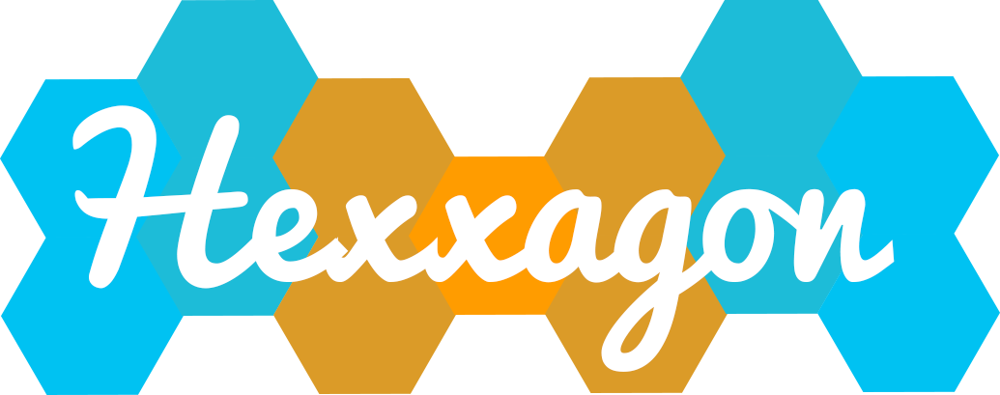

# Hexxagon
The game [Hexxagon](https://hexxagon.de) was created for the seminar "Analysis and implementation of mathematical games" at the University of Passau.

It is a online version of the board game "Hexxagon" incl. two AIs.

## How to play
The game can be played at [hexxagon.de](https://hexxagon.de).

## Built With
* [Dart](https://dart.dev/) - Programming language
* [Dart pub](https://pub.dev/) - Dependency Management
* [OverReact](https://github.com/Workiva/over_react) - React JS for Dart

## Authors
* **Kai Rädsch** - *Initial work* - [kairaedsch](https://github.com/kairaedsch)

## License
This project is released under the MIT License - See [LICENSE.md](LICENSE.md) for details
