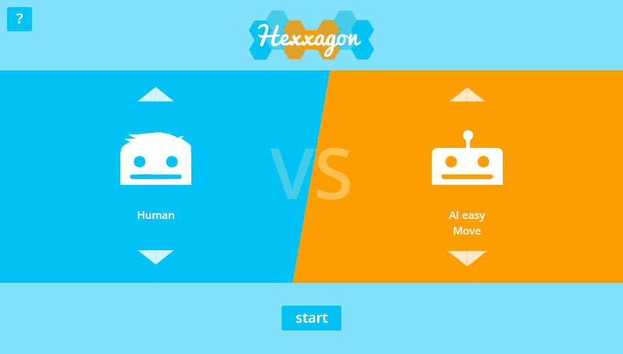

# Hexxagon
A online version of the board game "Hexxagon" incl. two AIs with different diffucult levels.

The game was created for the seminar "Analysis and implementation of mathematical games" at the University of Passau.

## How to play
The game can be played at [hexxagon.de](https://hexxagon.de).

## Features

### 🤖 Supported Artificial intelligences
| Artificial intelligence        | Description |
| ------------------------------ | - |
| **Monte Carlo Tree Search AI** | Optimised Monte Carlo method with Tree Search |
| **Monte Carlo Flat AI**        | The Monte Carlo Method |
| **MinMax AI**                  | The MinMax Algorithm, also called Minimax |

### 🏝 Supported Levels
| Level Name          | Description |
| ------------------- | - |
| **Hexxagon Island** | Level in form of a big hexagon with 3 blocked tiles in the middle |

## Built With
* [Dart](https://dart.dev/) - Programming language
* [Dart pub](https://pub.dev/) - Dependency Management
* [OverReact](https://github.com/Workiva/over_react) - React JS for Dart

## Authors
* **Kai Rädsch** - *Initial work* - [kairaedsch](https://github.com/kairaedsch)

## License
This project is released under the MIT License - See [LICENSE.md](LICENSE.md) for details
